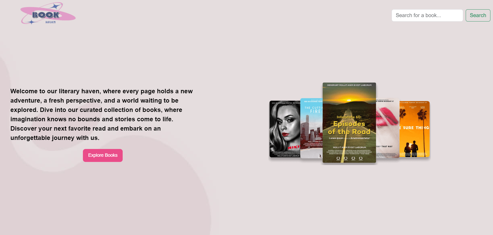

# Book store

This project uses the Open Library API to power a dynamic book store website with several features. It showcases books by categorizing books into comedy, horror, and action sections, displaying titles, authors, and "Read more" links that takes you to the book. Additionally, it offers a real-time search functionality that suggests relevant books as users type. Overall, it provides an engaging platform for discovering and exploring books.

### Built With

- HTML&CSS
- JS
- API integration

## Screenshots

